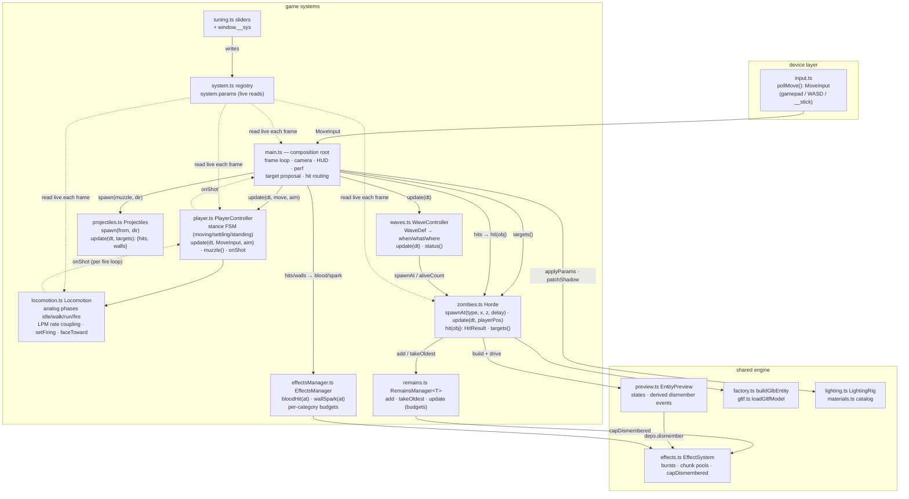

# DEATHTERRA — game systems architecture

Who calls whom, by what interface. `src/game/**` is the game; `src/inventory/**` +
`src/lib/**` is the shared engine (also consumed by the editor — changes there must
serve both hosts).

## The map

## Interfaces (the contracts that matter)

| System | Consumes | Provides | Notes |
|---|---|---|---|
| `input.ts` | devices | `MoveInput {x, y, mag}` | pure device layer; virtual stick slots in here |
| `PlayerController` | `MoveInput`, aim point | stance, `muzzle()`, `onShot` | ALL input interpretation lives here |
| `Locomotion` | mixer + clips | speed, fire-loop shots | LPM coupling, weight blending |
| `Projectiles` | targets `{object, point}[]` | `{hits, walls}` | segment-vs-sphere, instanced draw |
| `Horde` | docs, EffectSystem | `HitResult`, `targets()` | pool + AI + damage application |
| `WaveController` | `WaveDef`, Horde | wave state | data-driven; owns nothing visual |
| `RemainsManager<T>` | items + release fn | oldest-first custody | generic; budget policy in one place |
| `EffectsManager` | semantic calls | — | budgets/throttling; defs are `EffectDoc`s |
| `system.ts` | writes (tuning/upgrades) | `system.params` | read LIVE by consumers, never copied |

## SOLID review

- **SRP** — mostly tight. One flagged spot: `Horde` carries three responsibilities
  (instance pool, chase AI, damage/dismember application). Fine at one enemy type;
  when the second type lands, split into `EnemyPool` / per-type brains / a damage
  resolver. `main.ts` is intentionally procedural — it's the composition root; watch
  its size, not its style.
- **OCP** — waves are data (`WaveDef`), enemy types are data (`docs` record), effects
  are data (`EffectDoc`). New content shouldn't need new branches.
- **DIP** — the game depends on engine seams (`EffectSystem`, `EntityPreview`,
  `buildGlbEntity`) that the editor also exercises, so they stay honest.

## Event bus — not yet, and here's the trigger

Today the call graph is a shallow DAG where every arrow has exactly **one** consumer —
a bus would hide that flow without removing any coupling. The moment to introduce one
is the first real FAN-OUT: `enemyDied` is imminent (XP system + wave bookkeeping +
audio + UI will all care). When that lands: a small **typed** emitter (`events.ts`)
carrying gameplay FACTS only (`EnemyDied`, `WaveStarted`, `WaveCleared`), published by
Horde/WaveController. Frame-tick call chains stay direct calls — buses are for facts,
not for ticking.

## Instanced horde (the "tomorrow" plan)

Current per-entity path: each zombie = own skeleton clone + mixer (≈4 draws + shadow).
Fine to ~30–50 actors. The 100-enemy path (sketched in perf notes): bake all clips into
a bone-matrix DataTexture at load; ONE InstancedMesh per material for the whole horde;
TSL vertex skinning fetches bones from the texture; per-instance attributes carry
(clipIndex, phase, emissiveK, dismember mask). Loses mixer blending (hard switch or
2-slot crossfade in-shader). It forks the presentation path away from EntityPreview,
so we pay for it when profiling demands it — the pool/remains/registry seams are
already shaped for the swap.
